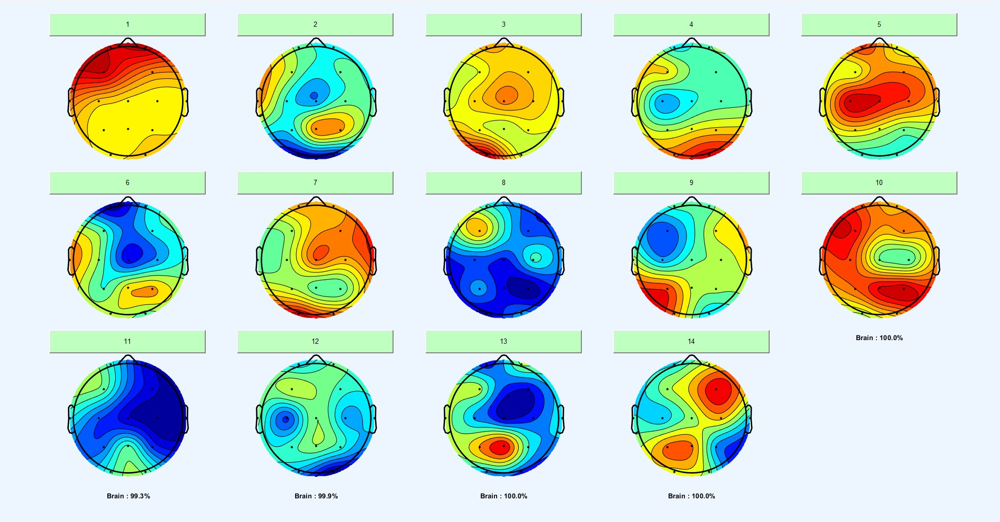

# bci_finalproject
This work has been developed to fulfill the requisites of the course titled '11120ISA557300: Brain Computer Interfaces: Fundamentals and Application', under the guidance of Prof. Chun-Hsiang Chuang.

## Authors

- SYED ASIF AHMAD QADRI (110065859)
- FINI IUNI (111065425)
- JEAN CARLOS (111065422)

## Table of contents

- [Introduction](#introduction)
- [Literature Survey](#literature-survey)
- [Objectives](#objectives)
- [Research Methodology](#research-methodology)
- [Dataset](#dataset)
- [Independent Component Analysis (ICA)](#analyzing-the-hidden-components-within-eeg-using-ica-with-iclabel)
- [Usage of the BCI Model's Code](#usage-of-the-bci-model's-code)
- [Validation]
- [Results and Discussion](#results-and-discussion)
- [Benchmarking](#benchmarking)
- [Conclusion and Future Works](#conclusion-and-future-works)
- [Demo Video](#demo-video)
- [References](#references)

## INTRODUCTION
Emotion recognition stands as a frontier topic in the interdisciplinary domain of psychology, neuroscience, and artificial intelligence, serving as a gateway to the next generation of human-computer interaction, and unlocking potential applications that range from healthcare, gaming, marketing to more personalized and responsive artificial intelligence systems. In this context, one promising modality for emotion recognition that has attracted significant attention is the use of Electroencephalogram (EEG).

As a neuroimaging technique, EEG captures the electrical activity of the brain, offering a direct interface with the neuronal signals that correspond to various cognitive states, including emotions. However, EEG signals are complex and often require advanced processing and analytical techniques to decipher the subtle patterns that correlate with different emotional states.

Amid this backdrop, this research leverages the SEED dataset, which comprises EEG recordings under three emotional states - Negative, Positive, and Neutral. This dataset, known for its robustness and validity in the context of EEG-based emotion recognition, provides a valuable foundation for our exploration.
To unravel the intricacies of these EEG signals, this study employs an array of signal processing techniques such as Independent Component Analysis (ICA) for artifact removal, Wavelet Energy, and Shannon Entropy for feature extraction, and Principal Component Analysis (PCA) for dimensionality reduction.

The extracted features are then used to train and test four different machine learning and deep learning models - Recurrent Neural Networks (RNN), Convolutional Recurrent Neural Networks (CRNN), two-layer Bidirectional Long Short-Term Memory (BiLSTM), and Convolutional Neural Network - BiLSTM (CNN-BiLSTM). These models were chosen due to their proven capability in handling sequence data and their robustness in various classification tasks.

Through a rigorous and systematic study, this research aims to explore the effectiveness of these models in classifying emotions based on EEG data and contribute to the broader goal of advancing EEG-based emotion recognition.

## LITERATURE SURVEY

The research studies on brain-computer interfaces (BCIs) and emotion recognition has grown a lot over the past decade. Many scientists and engineers have begin to explore the potential of BCIs in many application areas, including mental health and emotion regulation.

### 1. Brain Computer Interfaces (BCI)
BCIs have generated a lot of interest in recent years, as they promise to offer new ways to interact with environmental and technological systems directly through brain signals. BCI technology has been studied for a variety of applications, including assistive technology, gaming, and mental health (Wolpaw et al., 2002; Lotte et al., 2018).

### 2. Recognition and regulation of emotions.
Emotion recognition is a very complex cognitive process that allows us to identify and understand the emotions of others, which is essential for interpersonal communication and mental health (Kret & De Gelder, 2012). Studies have found that emotion regulation, which involves managing and responding to emotional experiences, is critical to mental health and well-being (Gross, 2014). Therefore, the recognition and regulation of emotions are vital in the search for better mental health interventions. Which can be of crucial help because mental issues on peoples due to emotions is a problem that has been on a rise in the recent years.

### 3. EEG for emotion recognition
EEG-based emotion detection has received increasing attention due to its potential to provide real-time objective indicators of emotional states. Scientists like Lin et al. (2010) and Koelstra et al. (2012) demonstrated the viability of using EEG signals for emotion detection and found that they are less susceptible to subjective interpretation than facial expressions or tones of voice.

### 4. Dimensional model for emotion recognition.
The dimensional model, which represents emotions in a coordinated space, has been widely used due to its intuitive nature. Several studies (Russell, 1980; Posner et al., 2005) have used this model and have highlighted its effectiveness in capturing the continuity and interrelationship of emotional experiences.

### 5. Deep learning in EEG emotion recognition
Deep learning algorithms have shown considerable success in various applications, including EEG emotion detection. Traditional machine learning methods often require manual feature extraction, which can be time consuming and error prone. However, deep learning provides automatic feature extraction and end-to-end classification, leading to better results (Cecotti & Graser, 2011; Bashivan et al., 2015).

The combination of BCI, emotion detection and regulation, EEG signals, dimensional modeling, and deep learning appears to be a promising avenue for further research. The next challenge is to effectively integrate these components to create a reliable and effective system for mental health applications.

## OBJECTIVES

-	To explore the feasibility of EEG-based emotion recognition using the SEED dataset.
-	To employ Independent Component Analysis (ICA) for artifact removal in the EEG dataset.
-	To apply Wavelet Energy and Shannon Entropy on the artifact-free EEG data for feature extraction.
-	To train and test four distinct ML and DL models, namely Recurrent Neural Networks (RNN), Convolutional Recurrent Neural Networks (CRNN), two-layer Bidirectional Long Short-Term Memory (BiLSTM), and Convolutional Neural Network - BiLSTM (CNN-BiLSTM) for emotion classification.
-	To compare and analyze the performance of these models to determine the most efficient model for EEG-based emotion recognition.

## RESEARCH METHODOLOGY
The research methodology adopted in this study is a systematic and rigorous sequence of steps, aimed at ensuring the accuracy and reliability of our emotion recognition model based on EEG data. This process starts from data acquisition and preprocessing, followed by artifact analysis and removal, feature extraction and finally, the training and testing of various machine learning and deep learning models. Below figure shows the basic flow of the methodology.

 

  

 

The methodology is designed with a focus on the quality of data, the appropriateness of the feature extraction techniques, and the suitability of the machine learning models used, ensuring each step contributes positively to the overall objective of achieving a robust EEG-based emotion recognition system.
1.	Data Acquisition and Preprocessing: The SEED dataset was procured, comprising EEG recordings in three distinct emotional states - Negative, Positive, and Neutral. Initial preprocessing steps were taken to prepare the raw EEG data for further analysis, thereby enhancing the accuracy and reliability of subsequent steps.
2.	ICA and Artifact Analysis: Independent Component Analysis (ICA) was applied to the preprocessed EEG data. This technique is advantageous for its ability to separate the EEG data into independent components, facilitating the identification and subsequent removal of artifacts. This approach ensures that the EEG data used in subsequent stages is free of noise and other irrelevant information, thereby enhancing the precision of the results.
3.	Feature Extraction: Wavelet Energy and Shannon Entropy were applied to the artifact-free EEG data. These methods have been chosen due to their proven efficiency in capturing essential features in temporal data such as EEG. They help transform complex EEG signals into a form that can be more readily understood and processed by the machine learning models.
5.	Model Training and Testing: Four different machine learning and deep learning models (RNN, CRNN, two-layer BiLSTM, and CNN-BiLSTM) were trained and tested on the processed dataset. These models were chosen due to their demonstrated efficacy in handling sequence data and their robust performance in various classification tasks. The implementation of these models allowed for a comparison of performance and the selection of the most efficient model for EEG-based emotion recognition.

## DATASET

Dataset (SEED) 
SEED dataset provided by the Brain-like Computing & Machine Intelligence (BCMI) laboratory, which is led by Prof. Bao-Liang Lu. To gain access to the SEED dataset, an application is required. Please visit the BCMI laboratory’s website to apply for access before using this dataset.

Download dataset in this link https://bcmi.sjtu.edu.cn/home/seed/
BCMI Laboratory homepage https://bcmi.sjtu.edu.cn/

Fifteen Chinese film clips were carefully chosen through a preliminary study, which tended to include emotions such as <b>positive</b>, <b>neutral</b>, and  <b>negative</b>. A total of 15 subjects participated in the experiment.

The experiment employed a 62-Channel ESI NeuroScan system and was designed as follows: each participant underwent three sessions on different days, with each session containing 24 trials. In each trial, the participant watched a film clip intended to induce a specific emotional state (positive, neutral, negative). While the participant was watching the clip, their EEG signals and eye movements were recorded.
 

  

 
 
The dataset comprises two files: eeg_raw_data and eye_raw_data. For the purpose of this experiment, we focused only on the eeg_raw_data. The eeg_raw_data folder contains the raw EEG signals from the 15 participants. Within eeg_raw_data, there are three folders named 1, 2, and 3, corresponding to the three sessions. Each .mat file is named in the format {subjectName}_{Date}.mat. These folders store a structure with fields named "cz_eeg1", "cz_eeg2", up to "cz_eeg24", which correspond to the EEG signal recorded during the 24 trials. For each of the signal processing, the raw EEG data are first downsampled to a 200 Hz sampling rate.
 

  

 

Our project, titled "Emotion Recognition from EEG Data Using Advanced Feature Extraction and Deep Learning Techniques", focuses on emotional responses. Therefore, we concentrated on 14 selected channels - the frontal (Fp1, Fp2, F3, F4), temporal (T3, T4), central (C3, Cz, C4), parietal (P3, Pz, P4), and occipital (O1, O2) for our analyses. 
 

 

 
 Initially, time-frequency analysis was conducted on three EEG channels - FP1, FP2, and F3. This analysis involved decomposing the EEG signals into time and frequency domains, allowing for the examination of how the spectral characteristics of the signals change over time. This is particularly important for understanding the dynamics of brain activity.
 

 

 
 After the time-frequency analysis, PSD was applied to the same three channels (FP1, FP2, and F3) to analyze the power distribution over various frequency bands. Initially, a baseline removal was applied to the PSD to normalize the spectral power relative to a reference period. However, upon visual inspection, it was observed that the removal of the baseline did not make a significant difference in this specific case.
 

  <table>
    <tr>
      <td>
        
      </td>
      <td>
        
      </td>
    </tr>
 </table>
     

 
 Finally, ERSP was applied to the three channels to analyze how the spectral power changes in response to specific events. ERSP is used to determine the average changes in amplitude over time and frequency in response to a stimulus or event, as compared to a baseline period. This provides insight into event-related brain dynamics and helps in understanding how the brain processes specific stimuli.
 

  <table>
    <tr>
      <td>
        
      </td>
      <td>
        
      </td>
      <td>
        
      </td>
    </tr>
 </table>
     

 

Overall, the combination of time-frequency analysis, PSD, and ERSP provided a comprehensive analysis of the EEG data for the three channels of interest. This suite of analyses can be invaluable in understanding both the temporal and spectral dynamics of brain activity, and in characterizing how the brain responds to specific events or stimuli.

## ANALYZING THE HIDDEN COMPONENTS WITHIN EEG USING ICA WITH ICLABEL

The analysis commenced with the loading of the EEG dataset into EEGLAB, followed by the visualization of the raw Independent Components (ICs) through the ICLabel plugin. This step served as an initial examination of the data before any pre-processing. Subsequently, a basic filter was applied to eliminate noise and confine the data to relevant frequencies. This filtered data was then plotted for visual inspection and comparison against the raw data. The next phase in the data processing involved Artifact Subspace Reconstruction (ARS), which is aimed at removing artifacts by reconstructing the EEG data. Post ARS, the ICLabel plugin was employed again to visualize the improved data quality. For a more granular analysis, attention was focused on channels FP1, FP2, and FP3. By juxtaposing the raw, filtered, and ARS-corrected plots of these channels, a subtle yet significant enhancement in data quality was discernible. The application of filtering and ARS correction reduced noise and rendered the EEG signals cleaner, which is instrumental for the accurate analysis of brain activity. This streamlined process underscores the importance of methodical preprocessing in EEG analysis, ensuring that the data is pruned and primed for further investigation.

  <table style="padding: 10px; border: solid 1px black">
  <tr>
    <td>&nbsp;</td>
    <td colspan="2" style="text-align: center; padding: 5px; font-weight: 600">
      Pre-processing
    </td>
    <td colspan="7" style="text-align: center; padding: 5px; font-weight: 600">
      Average numbers of ICs classified by ICLabel (FP1, FP2, F3)
    </td>
  </tr>
  <tr>
    <td>EEG (14 Channels & Eyeblink Dataset)</td>
    <td style="text-align: center; padding: 5px">bandpass filter</td>
    <td style="text-align: center; padding: 5px">ASR</td>
    <td style="text-align: center; padding: 5px">Brain</td>
    <td style="text-align: center; padding: 5px">Muscle</td>
    <td style="text-align: center; padding: 5px">Eye</td>
    <td style="text-align: center; padding: 5px">Heart</td>
    <td style="text-align: center; padding: 5px">Line Noise</td>
    <td style="text-align: center; padding: 5px">Channel Noise</td>
    <td style="text-align: center; padding: 5px">Other</td>
  </tr>
  <tr>
    <td>Raw</td>
    <td style="text-align: center; padding: 5px">&nbsp;</td>
    <td style="text-align: center; padding: 5px">&nbsp;</td>
    <td style="text-align: center; padding: 5px">FP1=76.6%   FP2=51.3%   F3=42.1%</td>
    <td style="text-align: center; padding: 5px">FP1=0.9%   FP2=2.2%   F3=2.2%</td>
    <td style="text-align: center; padding: 5px">FP1=0.1%   FP2=0.2%   F3=0.2%</td>
    <td style="text-align: center; padding: 5px">FP1=0.6%   FP2=0.1%   F3=0.3%</td>
    <td style="text-align: center; padding: 5px">FP1=3.7%   FP2=1.8%   F3=5.2%</td>
    <td style="text-align: center; padding: 5px">FP1=0.8   FP2=0.1%   F3=0.3%</td>
    <td style="text-align: center; padding: 5px">FP1=17%   FP2=44.3%   F3=49.7%</td>
  </tr>
  <tr>
    <td>Filtered</td>
    <td style="text-align: center; padding: 5px">v</td>
    <td style="text-align: center; padding: 5px">v</td>
     <td style="text-align: center; padding: 5px">FP1=99.9%   FP2=100.0%   F3=100.0%</td>
    <td style="text-align: center; padding: 5px">FP1=0.0%   FP2=0.0%   F3=0.0%</td>
    <td style="text-align: center; padding: 5px">FP1=0.0%   FP2=0.0%   F3=0.0%</td>
    <td style="text-align: center; padding: 5px">FP1=0.1%   FP2=0.0%   F3=0.0%</td>
    <td style="text-align: center; padding: 5px">FP1=0.0%   FP2=0.0%   F3=0.0%</td>
    <td style="text-align: center; padding: 5px">FP1=0.0   FP2=0.0%   F3=0.0%</td>
    <td style="text-align: center; padding: 5px">FP1=0.0%   FP2=0.0%   F3=0.0%</td>
  </tr>
  <tr>
    <td>ASR-corrected</td>
    <td style="text-align: center; padding: 5px">v</td>
    <td style="text-align: center; padding: 5px">&nbsp;</td>
    <td style="text-align: center; padding: 5px">FP1=99.9%   FP2=100.0%   F3=100.0%</td>
    <td style="text-align: center; padding: 5px">FP1=0.0%   FP2=0.0%   F3=0.0%</td>
    <td style="text-align: center; padding: 5px">FP1=0.0%   FP2=0.0%   F3=0.0%</td>
    <td style="text-align: center; padding: 5px">FP1=0.1%   FP2=0.0%   F3=0.0%</td>
    <td style="text-align: center; padding: 5px">FP1=0.0%   FP2=0.0%   F3=0.0%</td>
    <td style="text-align: center; padding: 5px">FP1=0.0%   FP2=0.0%   F3=0.0%</td>
    <td style="text-align: center; padding: 5px">FP1=0.0%   FP2=0.0%   F3=0.0%</td>
  </tr>
</table>
  

 
<table>
<tr>
  <td>RAW</td>
  <td> </td>
  <td>  </td>
  <td> </td>
  <td> </td>
</tr>
<tr>
  <td>FILTERED</td>
  <td> </td>
  <td> </td>
  <td>  </td>
  <td>  </td>
</tr>
<tr>
  <td>ARS CORRECTED</td>
  <td> </td>
  <td> </td>
  <td> </td>
  <td> </td>
</tr>
</table>
 

## USGAE OF THE BCI MODEL's CODE

### Environment and Dependencies

This code is developed and tested in a Python 3.9 environment using Anaconda Jupyter Notebook. In order to execute the code, your system should ideally meet the following requirements. However, please note that these are recommendations based on the development and testing environment and not strict necessities. Your code may still function on different configurations.

<b>Operating System:</b> Windows 11, MacOS Mojave, or any modern Linux distribution.
<b>Programming Language:</b> Python 3.8 or newer.

Before running the code, the following Python packages must be installed:

numpy
pandas
matplotlib
seaborn
scikit-learn
tensorflow

You can install these dependencies using pip:

<b>pip install numpy pandas tensorflow keras matplotlib scipy</b>

### Configurable Options or Parameters
 
The code includes a number of configurable parameters that you can adjust based on your specific needs:

<b>1. Optimizer:</b> This parameter is currently set to 'adam', which is a widely used optimizer. You may change it to another optimizer (like 'sgd', 'rmsprop', etc.) if desired.

<b>2. Loss Function:</b> The code uses 'sparse_categorical_crossentropy' as the loss function. Depending on your problem and data, you may want to use a different loss function.

<b>3. Metrics:</b> The code currently measures 'accuracy' as the metric. You may add other metrics like 'precision', 'recall', etc., or replace 'accuracy' entirely.

<b>4. Validation Split:</b> This parameter determines the portion of the training data to be used for validation. Currently, it's set at 0.2, meaning 20% of the training data is used for validation. You can adjust this percentage based on your preference.

<b>5. Batch Size:</b> The batch size is currently set at 32. This determines the number of samples per gradient update for training. This can be adjusted according to the memory capacity of your machine and your specific needs.

<b>6. Epochs:</b> The code is set to run for 50 epochs during the training phase. You can increase or decrease the number of epochs based on your requirements.

Remember to adjust these parameters within the <b>model.compile</b> and <b>model.fit</b> methods in the code.

## RESULTS AND DISCUSSION 

This section presents a comprehensive account of the experimental results derived from the four different machine learning and deep learning models used in this research. A rigorous quantitative analysis has been performed using well-established evaluation metrics such as precision, recall, F1-score, and the confusion matrix.

### Results obtained for Recurrent Neural Network (RNN)
The model utilizes TensorFlow's Keras API to construct a deep learning model. The main component of this model is a GRU layer, a type of RNN layer that's efficient at capturing long-term dependencies in sequential data, making it a good choice for time-series data such as EEG signals. The GRU layer in this model contains 256 units and outputs the hidden states for each time step, effectively preserving the sequential information inherent in the data. The output from the GRU layer is then flattened. Flattening is a process of converting all the resultant 1D arrays into a single long continuous linear vector to feed it to the next layer. This flattened output is passed into a Dense layer, which is a fully connected neural network layer. This layer has 3 units, corresponding to the 3 emotion classes: Negative, Neutral, and Positive. It uses a softmax activation function, which outputs a probability distribution over the 3 classes - in other words, each output represents the model's confidence that the input belongs to a particular class.

The performance of the RNN model utilizing a GRU layer was quite impressive, achieving a test accuracy of 97.5%. This means that in 97.5% of the instances, the model accurately predicted the emotion class for the given EEG data. The detailed classification report further breaks down this performance across each emotion class. For the Negative emotion, the model achieved a precision of 0.95, a recall of 0.99, and an F1-score of 0.97, based on 201 instances in the test set. For the Neutral emotion, the model was perfect in precision (1.00) and nearly perfect in recall (0.99), leading to an F1-score of 0.99 based on 231 instances. For the Positive emotion, the model achieved a precision of 0.97, a recall of 0.95, and an F1-score of 0.96 based on 208 instances. In the aggregate, the model achieved a macro average precision, recall, and F1-score of 0.97, and a weighted average precision and F1-score of 0.98, demonstrating its balanced and robust performance across all three emotion classes. The confusion matrix and classification report obtained using this RNN model provide a detailed view of the model's performance. These results suggest that this RNN model with a GRU layer can be effectively used for emotion recognition from EEG data.

### Results obtained for Convolutional Recurrent Neural Network (CRNN)
In this model framework, we are utilizing TensorFlow's Keras API to construct a deep learning architecture that combines convolutional and recurrent layers for emotion recognition from EEG data. The model starts with convolutional layers, where the first layer extracts 64 spatial features using a kernel size of 3 and ReLU activation, followed by a max pooling layer for downsampling. The second convolutional layer extracts 128 complex features, which are then further downsampled. These spatial features are then passed into a Gated Recurrent Unit (GRU) layer with 256 units, which captures the temporal dependencies in the data. The GRU layer outputs hidden states for each time step, preserving the sequential information. Finally, the output from the GRU layer is flattened and fed into a dense layer with softmax activation, producing probabilities for the 3 emotion classes: Negative, Neutral, and Positive. This architecture enables the model to effectively learn and classify EEG data based on emotions, combining spatial feature extraction, temporal dependency modeling, and multi-class classification.

The CRNN model achieved a test accuracy of 93.75%. This indicates that the model accurately predicted the emotion class for 93.75% of the instances in the test set. The classification report further breaks down the performance for each emotion class. For the Negative emotion, the model achieved a precision of 0.87, a recall of 0.94, and an F1-score of 0.90, based on 201 instances in the test set. For the Neutral emotion, the model achieved perfect precision (1.00), recall (1.00), and F1-score (1.00) based on 231 instances. For the Positive emotion, the model achieved a precision of 0.94, a recall of 0.87, and an F1-score of 0.90 based on 208 instances. In the macro average, the model achieved a precision, recall, and F1-score of 0.94, demonstrating its balanced performance across all three emotion classes. The weighted average precision and F1-score were both 0.94, indicating the model's overall effectiveness. These results highlight the strong performance of the CRNN model for emotion recognition from EEG data. The confusion matrix and classification report obtained using this CRNN model provide a detailed view of the model's performance.

### Results obtained for Two-Layer Bidirectional LSTM Model
In this model framework, we are utilizing TensorFlow's Keras API to construct a deep learning architecture for emotion recognition from EEG data. The model is based on Bidirectional Long Short-Term Memory (BiLSTM) layers, which are well-suited for capturing both past and future temporal dependencies in sequential data. The input layer is defined with a shape that matches the number of features in the training data. The input data is then expanded along the second axis using tf.expand_dims() to match the expected shape for a 1D convolutional layer. The first BiLSTM layer is configured as a bidirectional LSTM with 256 units and return_sequences=True. This means that it outputs the hidden states for each time step, preserving the sequential information. The first BiLSTM layer takes the expanded input tensor as input. The output from the first BiLSTM layer is then passed to another BiLSTM layer with 128 units. This second BiLSTM layer is also bidirectional but does not return sequences. It further processes the sequential information captured by the previous layer. Finally, a dense layer with softmax activation is added to produce the final output probabilities for the three emotion classes: Negative, Neutral, and Positive. The output of the second BiLSTM layer is used as input to this dense layer. This model architecture leverages BiLSTM layers to capture both past and future temporal dependencies in the EEG data. The bidirectional nature of the layers allows them to learn patterns in both directions, enhancing the model's ability to recognize emotion-related patterns.

The results obtained by the BiLSTM model for emotion recognition are highly promising. The model achieved a test accuracy of 98.125%, which indicates its ability to accurately classify EEG data into the correct emotion categories. This test accuracy represents the highest achieved among the models evaluated. The classification report provides additional insights into the model's performance for each emotion class. For the "NEGATIVE" class, the precision is 0.97, indicating a high proportion of correctly predicted negative emotions out of all predicted negative emotions. The recall is 0.98, suggesting that the model effectively identifies the true negative emotions from the dataset. The f1-score, which combines precision and recall, is 0.97, indicating a balanced performance for the negative class. Similarly, for the "NEUTRAL" class, the precision and recall are both 1.00, highlighting the model's ability to accurately predict neutral emotions and identify all true neutral emotions in the dataset. The f1-score is also 1.00, indicating excellent performance for the neutral class. For the "POSITIVE" class, the precision is 0.98, indicating a high proportion of correctly predicted positive emotions. The recall is 0.97, suggesting the model effectively captures most of the true positive emotions. The f1-score for the positive class is 0.97, indicating a balanced performance between precision and recall. The confusion matrix and classification report obtained using this Two-Layer BiLSTM model provide a detailed view of the model's performance.

Overall, the model demonstrates high accuracy and balanced performance across all emotion classes, as evidenced by the macro and weighted average f1-scores of 0.98. These results indicate that the BiLSTM model effectively captures the underlying patterns and dependencies in the EEG data to accurately classify emotions.

### Results obtained for CNN-BiLSTM
In this model framework, we are utilizing TensorFlow's Keras API to construct a deep learning architecture that combines convolutional and recurrent layers for emotion recognition from EEG data. The model architecture begins with an input layer that matches the number of features in the training data. The input data is then expanded along the second axis using tf.expand_dims() to match the expected shape for a 1D convolutional layer. Next, convolutional layers are applied to extract spatial features from the input data. The first convolutional layer applies 64 filters with a kernel size of 3 and ReLU activation. This is followed by a max pooling layer that reduces the spatial dimensions of the feature maps. The second convolutional layer applies 128 filters with a kernel size of 3 and ReLU activation. Another max pooling layer is then applied to further down sample the feature maps. Following the convolutional layers, bidirectional LSTM (BiLSTM) layers are introduced to capture the temporal dependencies in the data. The first BiLSTM layer is configured as a bidirectional LSTM with 256 units and return_sequences=True. This layer outputs hidden states for each time step, preserving the sequential information. The output of the first BiLSTM layer is then passed to another BiLSTM layer with 128 units. A dense layer with ReLU activation is added after the second BiLSTM layer to further process the learned features. Finally, a dense layer with SoftMax activation is added to produce the final output probabilities for the three emotion classes: Negative, Neutral, and Positive. The model is constructed using the defined inputs and outputs, resulting in a Keras Model object. This architecture combines spatial feature extraction through convolutional layers, temporal dependency modeling using BiLSTM layers, and multi-layer perceptron (MLP) layers for further processing and classification.

The results obtained by the model based on the combined convolutional and recurrent architecture are promising, although slightly lower compared to the BiLSTM model. The model achieved a test accuracy of 92.656%, indicating its ability to classify EEG data into the correct emotion categories with a high level of accuracy. The classification report provides a detailed analysis of the model's performance for each emotion class. For the "NEGATIVE" class, the precision is 0.91, suggesting a high proportion of correctly predicted negative emotions out of all predicted negative emotions. The recall is 0.87, indicating the model effectively identifies the true negative emotions from the dataset. The f1-score, which combines precision and recall, is 0.89, indicating a balanced performance for the negative class. For the "NEUTRAL" class, the precision and recall are both 1.00, highlighting the model's ability to accurately predict neutral emotions and identify all true neutral emotions in the dataset. The f1-score is also 0.99, indicating excellent performance for the neutral class. For the "POSITIVE" class, the precision is 0.86, indicating a high proportion of correctly predicted positive emotions. The recall is 0.92, suggesting the model effectively captures most of the true positive emotions. The f1-score for the positive class is 0.89, indicating a balanced performance between precision and recall. The confusion matrix and classification report obtained using this CNN-BiLSTM model provide a detailed view of the model's performance.

Overall, the model demonstrates high accuracy and balanced performance across all emotion classes, as evidenced by the macro and weighted average f1-scores of 0.92 and 0.93, respectively. Although slightly lower than the BiLSTM model, these results indicate that the combined convolutional and recurrent architecture effectively captures both spatial and temporal patterns in the EEG data to accurately classify emotions

Below, is the table showcasing the test accuracies of the four models utilized for emotion recognition from EEG data. The table provides a comprehensive overview of the performance of each model and their respective accuracies in accurately classifying emotions.

<table style="padding: 10px; border: solid 1px black">
  <tr>
    <td><b>MODEL NAME</b></td>
    <td  style="text-align: center; padding: 5px; font-weight: 600">
      <b>TEST ACCURACIES % </b>
    </td>
  </tr>
  <tr>
    <td> RNN</td>
    <td  style="text-align: center; padding: 5px; font-weight: 600">
     97.50
    </td>
  </tr><tr>
    <td> CRNN</td>
    <td  style="text-align: center; padding: 5px; font-weight: 600">
      93.75
    </td>
  </tr><tr>
    <td> TWO-LAYER BiLSTM</td>
    <td  style="text-align: center; padding: 5px; font-weight: 600">
      98.12
    </td>
  </tr><tr>
    <td> CNN-BiLSTM</td>
    <td  style="text-align: center; padding: 5px; font-weight: 600">
     92.656
    </td>
  </tr>
  </table>
  
  ## BENCHMARKING 
  
 In this section, we delve into the process of benchmarking the performance of our study against the state-of-the-art methodologies prevalent in our field. By adopting a comprehensive, comparative analysis, we seek to underscore our study's strengths, identify potential areas for improvement, and place our findings in the context of established practices. This holistic approach facilitates a deeper understanding of our position within the scientific community and paves the way for future advancements.
 
 
 
 ## CONCLUSION AND FUTURE WORKS

## References
- Bashivan, P., Rish, I., Yeasin, M., & Codella, N. (2015). Learning Representations from EEG with Deep Recurrent-Convolutional Neural Networks. arXiv preprint arXiv:1511.06448.
- Cecotti, H., & Graser, A. (2011). Convolutional neural networks for P300 detection with application to brain-computer interfaces. IEEE Transactions on Pattern Analysis and Machine Intelligence, 33(3), 433-445.
- Gross, J. J. (2014). Emotion regulation: Conceptual and empirical foundations. In Handbook of emotion regulation (2nd ed., pp. 3-20). Guilford Press.
- Koelstra, S., Mühl, C., Soleymani, M., Lee, J. S., Yazdani, A., Ebrahimi, T., ... & Patras, I. (2012). DEAP: A database for emotion analysis; using physiological signals. IEEE Transactions on Affective Computing, 3(1), 18-31.
- Kret, M. E., & De Gelder, B. (2012). A review on sex differences in processing emotional signals. Neuropsychologia, 50(7), 1211-1221.
- Lin, Y. P., Wang, C. H., Jung, T. P., Wu, T. L., Jeng, S. K., Duann, J. R., & Chen, J. H. (2010). EEG-based emotion recognition in music listening. IEEE Transactions on Biomedical Engineering, 57(7), 1798-1806.
- Lotte, F., Bougrain, L., Cichocki, A., Clerc, M., Congedo, M., Rakotomamonjy, A., & Yger, F. (2018). A review of classification algorithms for EEG-based brain–computer interfaces: a 10-year update. Journal of neural engineering, 15(3), 031005.
- Posner, J., Russell, J. A., & Peterson, B. S. (2005). The circumplex model of affect: An integrative approach to affective neuroscience, cognitive development, and psychopathology. Development and psychopathology, 17(3), 715-734.
- Russell, J. A. (1980). A circumplex model of affect. Journal of personality and social psychology, 39(6), 1161.
- Wolpaw, J. R., Birbaumer, N., McFarland, D. J., Pfurtscheller, G., & Vaughan, T. M. (2002). Brain–computer interfaces for communication and control. Clinical neurophysiology, 113(6), 767-791.
